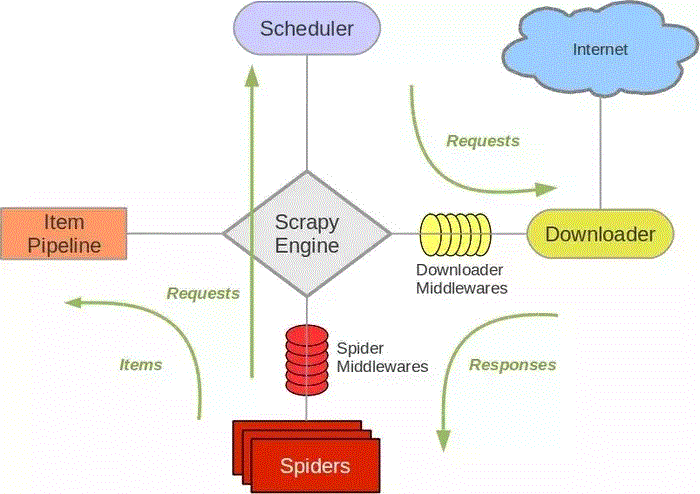

# 爬虫技术整理

#### 基本库都有哪些？
如果只是简易爬虫的话使用requests和re就可以了，这两个库就可以覆盖大部分需求

#### 解析库都有哪些？特点是什么？

| 解析库 | 速度 | 特点 |
| ------ | ------ | ------ |
| re | 快 | 对正则的掌握要求较高 |
| XPath | 较快 | 配合chrome可视化插件XPath Helper事半功倍 |
| Beautiful Soup | 看解析器 | 解析依赖解析器不同解析器的速度不一样lxml解析器速度更快 |
| pyquery | 较快 | 适合掌握jQuery的同学 |

#### 数据存储方式，特点？

| 存储方式 | 读取和查询 |
| ------ | ------ |
| txt | 读取查询效果较差 | 
| json | 结构化的数据读取查询效果一般 | 
| csv | 表格数据存储，数据分析常用的存储方式 | 
| mysql | 爬虫数据不像业务数据，爬虫数据经常会出现结构变更的问题，而mysql不是很适合这种场景 |
| MongoDB | 爬虫数据用的比较多，灵活，查询方便 | 
| redis | 数据放在内存中，资源比较昂贵，可以用作分布式爬虫系统的去重，任务调度 | 

#### Ajax是什么？

Ajax是一种技术，可以在页面不刷新。链接不改变的情况下和服务器交换数据
按发展趋势来看这种形式页面越来越多，使用ajax前后端分析，可也以减少服务器直接渲染页面带来的压力

#### 图片如何去重？

图片名称用图片内容的MD5值

#### 动态渲染页面如何抓取？

| 抓取方式 | 读取和查询 |
| ------ | ------ |
| 直接请求 | 开发者工具查看XHR伪造请求获得结构化数据 | 
| Splash | 可见即可爬，无头浏览器,可通过Lua控制渲染过程,由于chrome已经支持无头模式，这个慢慢被弃用了 | 

#### 验证码如何识别？

| 验证码类型| 识别方式 | 特点 |
| ------| ------ | ------ |
| 普通数字英文字母验证码 | ORC文字识别 | 应用场景有限，针对比较简单的验证码，可能还需要对原图片做一些调整以便更好识别 | 
| 极验滑动验证码 | Selenium模拟表单提交或者识别加密参数 | 模拟表单提交这个在大规模爬取的时候会拖累效率，识别加密参数的话对个人水平要求较高 | 
| 点触验证码 | 较为复杂的验证码直接交给打码平台处理 | 
| 微博宫格验证码 | 找轨迹，模拟人的行为，模板匹配 |

#### 代理都有哪些？

| 代理来源 | 特点 |
| ------ | ------ |
| 免费代理 | 免费代理一般质量不高，要自己做一些对应的代理质量检测|
| 付费代理 | 按需选择自己需要的代理类型 | 
| ADSL拨号 | 徐娅自己搭建服务器，无限次更换IP,线路稳定抓取效果号 | 

#### 模拟登录的Cookies池和ProxyPool如何实现？
https://github.coivfPython3WebSpider/ProxyPool
https://github.coivfPython3WebSpider/CookiesPool

#### App爬取
App爬取数据传递多通过json获取和解析也比较方便
抓包工具选择Charles图形界面 功能更强大，跨平台支持更好
mitmproxy 控制台形似操作，可以对接python
Appium 可见即可爬类似Seleium, 
配合抓包工具使用更佳,由于微信做了加密，
所以直接使用Appium可以做到可见即可爬,缺点是还没有那么稳定

#### 主流的爬虫框架都有哪些？

pyspider

pyspider 带有强大的 WebUI、脚本编辑器、任务监控器、项目管理器以及结果处理器，它支持多 种数据库后端、 多种消息队列、 JavaScript 渲染页面的爬取，使用起来非常方便
特点(快速页面抓取)
* 提供方便易用的 WebUI 系统，可视化地编写和调试爬虫。 
* 提供爬取进度监控、 爬取结果查看、爬虫项目管理等功能。 
* 支持多种后端数据库，如 MySQL、 MongoDB、 Redis、 SQLite、 Elasticsearch、 PostgreSQL。 
* 支持多种消息队列，如 RabbitMQ、 Beanstalk、 Redis、 Kombu。 
* 提供优先级控制、失败重试、定时抓取等功能。 
* 对接了 PhantomJS，可以抓取 JavaScript渲染的页面。 
* 支持单机和分布式部署，支持 Docker部署

Scrapy
基于twisted 异步处理框架

 

架构清晰，模块低耦合，可扩展行强，可以完成各种需求
架构分为以下几部分
*  Engine。 引擎，处理整个系统的数据流处理、触发事务，是整个框架的核心。 
* Item。 项目，它定义了爬取结果的数据结构，爬取的数据会被赋值成该 Item 对象。 
* Scheduler。 调度器，接受引擎发过来的请求并将其加入队列中 ， 在引擎再次请求的时候将 请求提供给引擎。 
* Downloader。 下载器，下载网页内容，并将网页内容返回给蜘蛛。 
* Spiders。 蜘蛛，其内定义了爬取的逻辑和网页的解析规则 ，它主要负责解析响应并生成提取 结果和新的请求。 
* Item Pipeline。 项目管道，负责处理由蜘蛛从网页中抽取的项目，它的主要任务是清洗、验 证和存储数据。 
* Downloader Middlewares。 下载器中间件，位于引擎和下载器之间的钩子框架，主要处理引 擎与下载器之间的请求及响应。 
* Spide「 Middlewares。 蜘蛛中间件，位于引擎和蜘蛛之间的钩子框架，主要处理蜘蛛输入的 响应和输出的结果及新的请求

项目文件功能描述

* scrapy.cfg ： 它是 Scrapy 项目的配置文件，其内定义了项目的配置文件路径、 部署相关信息 等内容。 
* items.py： 它定义 Item 数据结构，所有的 Item 的定义都可以放这里。 
* pipelines.py： 它定义 Item Pipeline 的实现，所有的 Item Pipeline 的实现都可以放这里。 
* settings.py： 它定义项目的全局配置。 
* middlewares.py： 它定义 Spider Middl巳wares 和 Downloader Middlewares 的实现。 
* spiders： 其内包含一个个 Spider 的实现，每个 Spider都有一个文件。

#### 分布式爬虫用的的技术？

分布式框架 Scrapy-Redis
网页链接去重使用 Bloom Filter节省空间
Scrapyd 分布式部署
docker处理虚拟环境的问题
Scrapyd-Client部署工具
Gerapy 分布式管理

#### 如何在github上快速找到某些网站的爬虫？
scrapy toutiao.com
